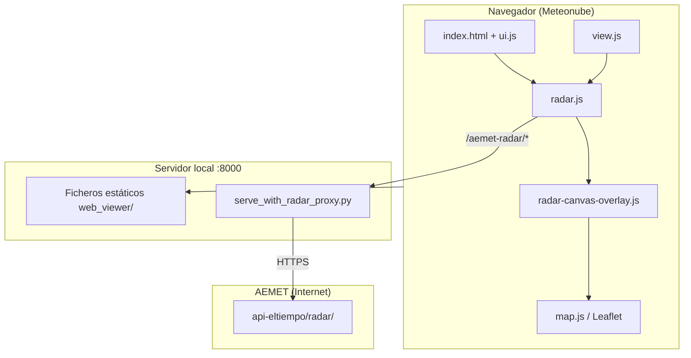

# Informe detallado: implementación del radar de lluvia en Meteonube

**Fecha:** mayo 2026 (actualizado)  
**Componente:** visor web `web_viewer/`  
**Fuente de datos:** AEMET — radar regional CCD (A Coruña / Galicia)

---

## 1. Resumen ejecutivo

Meteonube integra **radar de precipitación en tiempo casi real** procedente de **AEMET** (Agencia Estatal de Meteorología), concretamente del radar regional **CCD (A Coruña–Cerceda)**, que cubre Galicia con un radio de **240 km**.

La implementación es **100 % cliente web** (JavaScript + Leaflet), con un **proxy Python local** que evita problemas de CORS al consultar la API pública de AEMET. El radar convive con las capas WRF del modelo, pero de forma **exclusiva**: al activarlo se ocultan los datos del modelo y viceversa.

La georreferenciación usa las **4 esquinas geográficas** que devuelve la API de AEMET (`bounds-radar`), con un **overlay híbrido**: capa rápida (`L.imageOverlay`) en el caso habitual del radar CCD y capa canvas con warping solo si las esquinas forman un cuadrilátero no rectangular.

**Versión actual del visor:** `main.js?v=93`, `style.css?v=51`.

---

## 2. Objetivo funcional

| Requisito | Implementación |
|-----------|----------------|
| Ver lluvia observada (no predicción WRF) | Imágenes PPI de reflectividad (dBZ) de AEMET |
| Enfoque en Galicia | Estación **CCD** (Cerceda, A Coruña) |
| Superponer sobre mapa base | Overlay híbrido en `radarPane` (ver sección 6) |
| Georreferenciación precisa | 4 esquinas de `/bounds-radar/` (API AEMET) |
| Elegir hora / animar | Slider temporal + botón ▶ (12 frames, cada 10 min) |
| No bloquear el resto de la UI | Al pulsar otra variable, el radar se desactiva |
| Funcionar en móvil por WiFi | Servidor en `0.0.0.0:8000` + proxy |
| Leyenda correcta | Escala dBZ de AEMET (no mm del WRF) |
| Rendimiento fluido | `L.imageOverlay` cuando las esquinas son rectángulo (caso CCD) |

---

## 3. Arquitectura general



### Capas en el mapa (orden Z)

1. Mapa base (OpenTopoMap, etc.)
2. Capas WRF (cuando radar **OFF**)
3. **`radarPane`** (z-index 15) — imagen radar
4. Bordes / provincias
5. Partículas de viento

---

## 4. Fuente de datos AEMET

### Producto

- **PPI** (Plan Position Indicator): reflectividad en dBZ, barrido a 0,5° sobre el horizonte.
- Sufijo de fichero: `PPI.Z_005_240` → elevación 0,5°, alcance 240 km.

### Estación

- **CCD** — A Coruña–Cerceda
- Centro: `43.16902998, -8.52690718`

### Formato de fichero de imagen

```
CCD{YY}{MM}{DD}{HH}{MM}00.PPI.Z_005_240.png
```

Ejemplo: `CCD260524230000.PPI.Z_005_240.png` = 25-may-2026, 23:00 UTC (= 01:00 hora Madrid en verano).

### Endpoints AEMET (vía proxy `/aemet-radar/`)

| Ruta local | Upstream AEMET | Uso |
|------------|----------------|-----|
| `/aemet-radar/timeline/PPI/CCD` | `.../timeline/PPI/CCD` | Lista de frames disponibles |
| `/aemet-radar/imagen-radar/PPI/{fichero}` | `.../imagen-radar/PPI/{fichero}` | PNG del radar |
| `/aemet-radar/bounds-radar/PPI/{fichero}` | `.../bounds-radar/PPI/{fichero}` | 4 esquinas geográficas del PNG |
| `/aemet-radar/leyenda-radar/PPI` | `.../leyenda-radar/PPI` | Colores → dBZ |

### Formato de `bounds-radar` (4 esquinas)

La API devuelve un anillo de 4 puntos `[lng, lat]` en este orden:

| Índice | Esquina geográfica |
|--------|-------------------|
| 0 | SE (sureste) |
| 1 | NE (noreste) |
| 2 | NW (noroeste) |
| 3 | SW (suroeste) |

Ejemplo real (frame CCD):

```
[0.527, 34.973]   → SE
[0.527, 51.329]   → NE
[-17.586, 51.329] → NW
[-17.586, 34.973] → SW
```

Meteonube los reordena internamente a **[NW, NE, SE, SW]** para mapear píxeles de imagen → coordenadas.

---

## 5. Servidor proxy (backend)

### Archivo creado: `web_viewer/serve_with_radar_proxy.py`

Sirve los ficheros estáticos del visor **y** reenvía peticiones `/aemet-radar/` a AEMET.

```python
#!/usr/bin/env python3
"""Servidor estático do visor + proxy /aemet-radar/ → AEMET (evita CORS no navegador)."""
import http.server
import ssl
import sys
import urllib.error
import urllib.request
from pathlib import Path

AEMET_RADAR_PREFIX = '/aemet-radar/'
AEMET_RADAR_UPSTREAM = 'https://www.aemet.es/es/api-eltiempo/radar/'
ROOT = Path(__file__).resolve().parent
DEFAULT_PORT = 8000

class RadarProxyHandler(http.server.SimpleHTTPRequestHandler):
    def __init__(self, *args, **kwargs):
        super().__init__(*args, directory=str(ROOT), **kwargs)

    def do_GET(self):
        if self.path.startswith(AEMET_RADAR_PREFIX):
            self._proxy_aemet()
            return
        super().do_GET()

    def _proxy_aemet(self):
        rel = self.path[len(AEMET_RADAR_PREFIX):].split('?', 1)[0]
        upstream = AEMET_RADAR_UPSTREAM + rel
        # ... fetch AEMET, devuelve con CORS * y Cache-Control: no-cache
```

**Por qué es necesario:** el navegador bloquea peticiones directas de `localhost` → `aemet.es` (CORS). El proxy hace de intermediario en el mismo origen.

### Archivo modificado: `web_viewer/run_server.sh`

El script de arranque usa `serve_with_radar_proxy.py` en lugar de `python -m http.server`:

```bash
# Start server in background (static + proxy radar AEMET)
nohup python3 serve_with_radar_proxy.py $port > "$web_server_log" 2>&1 &
```

**Arranque:**

```bash
cd web_viewer
./run_server.sh restart -f
```

**Acceso móvil:** `http://<IP-del-PC>:8000/`

---

## 6. Módulos del radar

### 6.1 `web_viewer/js/radar.js` — Lógica principal

Archivo **nuevo** (~600 líneas). Timeline, animación, auto-refresh, integración con UI.

#### Constantes de configuración

```javascript
const RADAR_API_BASE = '/aemet-radar';
const RADAR_STATION = 'CCD';
const RADAR_PARAM = 'PPI';
const RADAR_RADIUS_KM = 240;
const RADAR_CENTER = { lat: 43.16902998, lng: -8.52690718 };

// Georreferenciación del PNG (3050×3811 px; disco útil ~501 px = 240 km)
const RADAR_IMAGE_WIDTH_PX = 3050;
const RADAR_IMAGE_HEIGHT_PX = 3811;
const RADAR_DISC_RADIUS_PX = 501;

const RADAR_FRAME_WINDOW = 12;      // 12 frames = 2 h de historia
const RADAR_ANIM_MS = 900;          // velocidad animación
const FRAME_INTERVAL_MIN = 10;      // AEMET publica cada 10 min
const RADAR_TIMELINE_REFRESH_MS = 30 * 1000;  // refresco cada 30 s
```

#### Funciones exportadas

| Función | Rol |
|---------|-----|
| `initRadarModule(deps)` | Recibe callbacks de UI (`syncTogglesUI`, `refreshView`, etc.) |
| `setRadarEnabled(bool)` | Activa/desactiva radar |
| `syncRadarLayer()` | Sincroniza capa Leaflet con el estado |
| `setupRadarControls()` | Enlaza slider, ▶ y evento `visibilitychange` |
| `stepRadarFrame(delta)` | Avanza/retrocede un frame |
| `toggleRadarAnimation()` | Play/pausa animación |

#### Flujo al activar el radar

```
Usuario pulsa "📡 Radar"
    → setRadarEnabled(true)
    → clearDataLayersForRadar()  [ui.js: quita capas WRF]
    → syncRadarLayer()
    → loadAndShowRadar()
        → ensureRadarProxy()     [comprueba /aemet-radar/timeline/...]
        → buildTimeline()        [API o sintética]
        → prefetchRadarCorners() [cache esquinas por fichero]
        → showRadarFrameAtIndex(último)
        → startRadarAutoRefresh() [cada 30 s]
        → updateRadarScale()     [leyenda dBZ]
```

---

### 6.2 `web_viewer/js/radar-canvas-overlay.js` — Capa híbrida de 4 esquinas

Archivo **nuevo** (~270 líneas). Gestiona la colocación geográfica de la imagen radar.

#### Enfoque híbrido (rendimiento + precisión)

| Condición | Capa usada | Motivo |
|-----------|------------|--------|
| Esquinas forman **rectángulo alineado** (caso CCD) | `L.imageOverlay` | Rápido: el navegador mueve un `` con GPU |
| Esquinas forman **cuadrilátero deformado** | `RadarCanvasOverlay` | Canvas con warping por triángulos |

El radar CCD de AEMET **siempre** devuelve un rectángulo alineado, por lo que en la práctica se usa `L.imageOverlay`. El canvas queda como respaldo para otros productos o geometrías futuras.

#### Función principal

```javascript
export function createRadarOverlay(url, corners, options) {
    if (cornersAreAxisAligned(corners)) {
        const layer = L.imageOverlay(url, cornersToBounds(corners), options);
        layer.setCorners = function setCorners(c) {
            return this.setBounds(cornersToBounds(c));
        };
        return layer;
    }
    return new RadarCanvasOverlay(url, corners, options);
}
```

#### Conversión del anillo AEMET

```javascript
// Orde API: SE(0), NE(1), NW(2), SW(3) → Meteonube: NW, NE, SE, SW
export function cornersFromAemetRing(ring, center) {
    // ... validación (cerca de Galicia, span plausible)
    return [pts[2], pts[1], pts[0], pts[3]];
}
```

#### Canvas overlay (caso excepcional)

Si las esquinas no son rectángulo, `RadarCanvasOverlay`:

- Carga la imagen en un `` oculto
- En cada `move` / `zoom` / `viewreset`, proyecta las 4 esquinas a píxeles del mapa
- Dibuja la imagen en `<canvas>` mediante **2 triángulos afines** (warping)
- Expone la misma API: `setUrl`, `setCorners`, `setOpacity`, evento `error`

> **Nota de rendimiento:** esta capa canvas redibuja en cada movimiento del mapa y es **mucho más pesada** que `imageOverlay`. Por eso el modo híbrido la evita en el radar CCD.

---

### 6.3 Construcción de la timeline

**Prioridad 1 — API AEMET:**

```javascript
fetch('/aemet-radar/timeline/PPI/CCD')
  → extractCcdFramesFromBlock()
      → cruza lineaTiempo oficial con Elementos CCD
      → normalizeTimelineFrames() → últimos 12 frames
```

**Prioridad 2 — Timeline sintética** (si la API falla):

- Genera 12 slots de 10 min alineados a hora de Madrid.
- Construye nombres de fichero con `buildRegionalFicheroFromDate()`.

---

### 6.4 Visualización en el mapa

```javascript
async function showRadarFrameAtIndex(index) {
    const frame = state.radarFrames[clamped];
    const url = radarImageUrl(frame.fichero);
    const corners = await resolveRadarCorners(frame.fichero);

    state.radarLayer = createRadarOverlay(url, corners, {
        opacity: state.variableLayerOpacity,
        pane: 'radarPane',
        interactive: false
    }).addTo(state.map);
}
```

`resolveRadarCorners(fichero)`:

1. Consulta `/bounds-radar/PPI/{fichero}` → `cornersFromAemetRing()`
2. Si la API falla → `computeRadarCorners()` (cálculo local desde dimensiones PNG)

---

### 6.5 Georreferenciación (punto crítico)

**Problema inicial:** las imágenes PNG de AEMET tienen **mucho margen gris** alrededor del círculo de lluvia. El círculo útil (~1002 px de diámetro) representa 240 km, pero el PNG completo mide 3050×3811 px. Sin corrección, la lluvia aparecía ~3× más pequeña que el mapa.

**Solución en dos niveles:**

1. **API bounds (preferida):** las 4 esquinas del PNG completo, tal como las publica AEMET.
2. **Cálculo local de respaldo** (`computeRadarBounds` / `computeRadarCorners`):
   - 501 px de radio = 240 km → escala `km/px`
   - El PNG entero se mapea a ~1460×1826 km centrado en Cerceda

**Evolución:**

| Fase | Método | Resultado |
|------|--------|-----------|
| v1 | `L.imageOverlay` + bounds min/max | Funcional tras corregir `RADAR_DISC_RADIUS_PX = 501` |
| v2 | Canvas 4 esquinas siempre | Georref. correcta, pero **lentitud al mover el mapa** |
| v3 (actual) | Híbrido: API 4 esquinas + `imageOverlay` si rectángulo | Misma precisión, rendimiento fluido |

Para el CCD, el resultado visual de v1 y v3 es equivalente porque las esquinas AEMET ya forman rectángulo; v3 garantiza además el orden correcto de vértices según la API oficial.

---

### 6.6 Actualización automática de datos

- **Cada 30 s** mientras el radar está activo (`refreshRadarTimeline`).
- **A los 15 s** del arranque, un refresco extra.
- **Al volver a la pestaña** del navegador (`visibilitychange`).
- Si el usuario está en el **último frame**, salta automáticamente al más reciente cuando AEMET publica uno nuevo.
- Peticiones con `cache: 'no-store'` para evitar datos viejos en caché.

---

### 6.7 Manejo de errores

- Si el proxy no responde → *"Servidor sen proxy radar. Executa: ./run_server.sh restart -f"*
- Si una imagen falla (404) → reintenta timeline; si persiste, elimina ese frame.
- Token `radarFrameShowToken` evita condiciones de carrera al cambiar de hora rápido.

---

## 7. Integración con el resto del visor

### 7.1 `web_viewer/js/store.js` — Estado global

```javascript
layers: { ..., radar: false, ... },
radarLayer: null,
radarFrameTime: null,
radarFrames: [],
radarFrameIndex: 0,
radarPlaying: false,
radarAnimTimer: null,
```

### 7.2 `web_viewer/js/ui.js` — Interfaz y exclusividad

**Inicialización:**

```javascript
initRadarModule({
    syncTogglesUI,
    syncRadarExclusiveUi,
    clearDataLayersForRadar,
    refreshView: () => updateImage(),
    syncRadarScale: () => updateRadarScale()
});
```

**Exclusividad radar ↔ WRF:**

- `clearDataLayersForRadar()`: vacía variables activas y capas WRF al encender radar.
- Al pulsar una variable WRF con radar ON → `setRadarEnabled(false)`.
- Clase CSS `radar-active-mode` en `<body>` para ocultar etiquetas WRF.

**Escala dBZ** (`updateRadarScale()`): fetch a `/aemet-radar/leyenda-radar/PPI`.

**Opacidad:** el slider de opacidad también afecta a `state.radarLayer`.

### 7.3 `web_viewer/js/view.js` — Capas del mapa

Cuando `state.layers.radar === true`:

- No carga grids WRF.
- Elimina overlays escalares, vectores y dinámicos.
- Muestra escala dBZ.
- Llama a `syncRadarLayer()`.

### 7.4 `web_viewer/js/map.js` — Mapa Leaflet

```javascript
state.map.createPane('radarPane');
state.map.getPane('radarPane').style.zIndex = 15;
```

---

## 8. Interfaz de usuario

### 8.1 HTML — `web_viewer/index.html`

**Botón en sidebar:**

```html
<button type="button" class="btn-toggle" id="toggle-radar"
    title="Radar de precipitación AEMET — A Coruña (Galicia, observación)">
    <span>📡 Radar</span>
</button>
```

**Controles temporales** (sustituyen fecha/hora WRF cuando radar ON):

```html
<div class="radar-time-controls hidden" id="radar-time-controls">
    <div class="radar-time-stack">
        <div class="radar-time-caption">Reflectividad radar (dBZ) · AEMET</div>
        <div class="radar-time-row">
            <span id="radar-time-label">--:--</span>
            <input type="range" id="radar-time-slider" ...>
            <button id="btn-radar-play">▶</button>
        </div>
    </div>
</div>
```

### 8.2 CSS — `web_viewer/style.css`

| Clase | Función |
|-------|---------|
| `.radar-time-controls` | Contenedor flex del slider |
| `.radar-time-stack` | Apila caption + fila de controles |
| `.radar-time-caption` | Texto "Reflectividad radar (dBZ) · AEMET" |
| `.radar-time-label` | Hora HH:MM a la izquierda del slider |
| `.radar-time-slider` | Slider de rango temporal |
| `.timeline-radar-mode` | Layout especial de la barra inferior |
| `body.radar-active-mode` | Oculta `#current-var-label` del WRF |
| `.sidebar-radar-widget` | Posición del botón Radar en sidebar |

---

## 9. Diagrama de flujo temporal

```
AEMET publica imagen cada ~10 min (con 10–20 min de retraso)
         │
         ▼
refreshRadarTimeline() cada 30 s
         │
         ▼
fetch timeline → extrae últimos 12 frames CCD
         │
         ▼
¿Frame nuevo? ──Sí──► showRadarFrameAtIndex(último)
         │
         No → mantiene frame seleccionado por usuario
         │
         ▼
resolveRadarCorners() → bounds-radar API (4 esquinas)
         │
         ▼
createRadarOverlay() → imageOverlay (CCD) o canvas (excepcional)
         │
         ▼
updateRadarTimeLabel() → "01:00" (hora Madrid)
```

---

## 10. Archivos tocados — resumen

| Archivo | Tipo | Cambio |
|---------|------|--------|
| `web_viewer/js/radar.js` | **NUEVO** | Módulo principal del radar |
| `web_viewer/js/radar-canvas-overlay.js` | **NUEVO** | Overlay híbrido 4 esquinas |
| `web_viewer/serve_with_radar_proxy.py` | **NUEVO** | Proxy HTTP → AEMET |
| `web_viewer/index.html` | Modificado | Botón radar, controles temporales, cache `v=93` |
| `web_viewer/style.css` | Modificado | Estilos radar, escala, layout timeline |
| `web_viewer/js/store.js` | Modificado | Estado `radar*`, `layers.radar` |
| `web_viewer/js/ui.js` | Modificado | Integración, escala dBZ, exclusividad |
| `web_viewer/js/view.js` | Modificado | Modo radar en overlays y grids |
| `web_viewer/js/map.js` | Modificado | Pane `radarPane` |
| `web_viewer/run_server.sh` | Modificado | Arranca proxy en lugar de http.server |
| `docs/radar-implementacion.md` | **NUEVO** | Este informe |

**No modificados directamente pero relevantes:**

- `js/main.js` — carga módulos vía `boot.js` → `ui.js` → `radar.js` → `radar-canvas-overlay.js`
- `js/boot.js`, `js/dom.js` — cableado general del visor

---

## 11. Despliegue

### Desarrollo local

```bash
cd /home/meteo/meteowrf/web_viewer
./run_server.sh restart -f
# http://localhost:8000/  o  http://192.168.x.x:8000/
```

### Producción (`app.meteonube.es`)

**Pendiente:** equivalente nginx del proxy:

```nginx
location /aemet-radar/ {
    proxy_pass https://www.aemet.es/es/api-eltiempo/radar/;
    proxy_set_header User-Agent Meteonube-Radar-Proxy/1.0;
    add_header Access-Control-Allow-Origin *;
    add_header Cache-Control no-cache;
}
```

Sin esto, el radar **no funcionará** en producción.

---

## 12. Limitaciones conocidas

| Limitación | Detalle |
|------------|---------|
| Retraso observacional | AEMET publica cada 10 min con ~15–20 min de retraso respecto a la hora real |
| Solo slots :00, :10, :20… | No existen imágenes de las :05, :15, etc. |
| Exclusivo con WRF | No se puede ver radar + precipitación del modelo a la vez |
| Proxy obligatorio | Sin `/aemet-radar/` en el servidor, no hay radar |
| Sin producción nginx | Falta configurar en `app.meteonube.es` |
| Canvas solo en casos raros | Si las esquinas no fueran rectángulo, el warping canvas sería más lento al pan/zoom |

---

## 13. Problemas resueltos durante la implementación

1. **CORS / ORB** → proxy Python local.
2. **Nombre de fichero incorrecto** (`…5000` vs `…500`) → formato UTC correcto en `buildRegionalFicheroFromDate`.
3. **Timeline con horas inexistentes** → usar solo `lineaTiempo` + `Elementos` de la API.
4. **Desajuste geográfico** (lluvia pequeña vs mapa) → bounds con `RADAR_DISC_RADIUS_PX = 501`.
5. **Datos desactualizados** → auto-refresh cada 30 s + `visibilitychange`.
6. **UI bloqueante** → radar se apaga al elegir otra capa WRF.
7. **Escala incorrecta** → leyenda dBZ de AEMET en lugar de mm WRF.
8. **Servidor antiguo** → `run_server.sh` usa `serve_with_radar_proxy.py`.
9. **Georref. con 4 esquinas AEMET** → `cornersFromAemetRing()` + `createRadarOverlay()`.
10. **Lentitud con canvas puro** → overlay híbrido: `imageOverlay` para rectángulos (CCD), canvas solo si hace falta warping.

---

## 14. Comparación con MeteoGalicia y visor AEMET

### MeteoGalicia

Usa **los mismos datos AEMET** (reflectividad dBZ, radar CCD). La diferencia de unos minutos en la etiqueta de hora suele deberse a:

- Meteonube muestra la **hora de observación** del barrido (`01:00`).
- MeteoGalicia puede mostrar la **hora de actualización** del visor (p. ej. `01:05`).

No hay producto AEMET con resolución de 5 minutos; los slots son cada 10 minutos.

### Visor oficial AEMET

AEMET usa `L.imageCanvasOverlay` (basado en `L.imageOverlay` + canvas oculto para leer píxeles bajo el cursor). Meteonube adopta las **mismas 4 esquinas** de `bounds-radar` pero, para el CCD, renderiza con `L.imageOverlay` directamente por rendimiento. La precisión geográfica es equivalente cuando las esquinas forman rectángulo.

---

## 15. Posibles mejoras futuras

1. **Proxy nginx en producción** (`app.meteonube.es`).
2. **Indicador de antigüedad** opcional ("−16 min" respecto a ahora).
3. **Radar peninsular** (composición) como alternativa fuera de Galicia.
4. **Lectura de dBZ bajo el cursor** (como AEMET, usando canvas oculto + `getPixelColor`).
5. **Optimizar canvas overlay** con `requestAnimationFrame` si se usa en productos no rectangulares.
